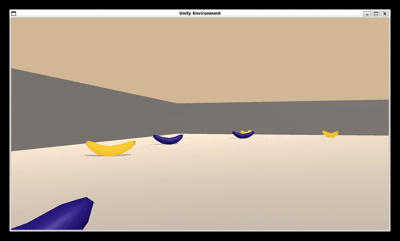
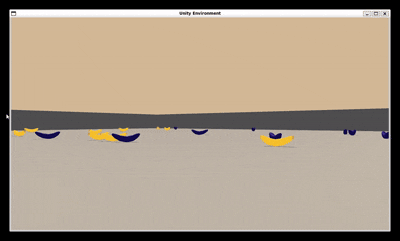

[//]: # (Image References)

[image1]: https://user-images.githubusercontent.com/10624937/42135619-d90f2f28-7d12-11e8-8823-82b970a54d7e.gif "Trained Agent"


# Deep Reinforcement Learning: Let's learn to collect yellow Bananas 🍌

This project implements a Deep Q-Network (DQN) to train an agent to navigate a 3D environment and collect yellow bananas while avoiding blue ones. The agent interacts with the Unity ML-Agents Banana environment.

Using PyTorch and Deep Q-Learning, the agent improves its decision-making over time, maximizing its score by collecting as many yellow bananas as possible while avoiding penalties from blue bananas. 

In the upcoming section [Project Details](#project-details), an introduction into the project and the environment follows. Further, one can get familiar with the necessary steps to run this project on your own local device in the [Getting Started](#getting-started) and [Dependencies](#dependencies) sections. The three previously mentioned sections are mainly authored by Udacity and were copied into the project. Some minor adjustments were made to these sections. After sucessfully downloading and installing the prerequisites, in the section [Instructions](#instructions) one can get to know the two different ways to run the training for the DQN Agent. The Training can be either executed via terminal or via the notebook `src/Training.ipynb` (This notebook represents the `Navigation.ipynb` noteboook). Finally, one can have a glimpse at the structure of the repository. 

#### Table of Contents

- [Deep Reinforcement Learning: Let's learn to collect yellow Bananas 🍌](#deep-reinforcement-learning-lets-learn-to-collect-yellow-bananas-)
      - [Table of Contents](#table-of-contents)
    - [Project Details](#project-details)
    - [Preview of the trained Agents](#preview-of-the-trained-agents)
    - [Getting Started](#getting-started)
    - [Dependencies](#dependencies)
    - [Instructions](#instructions)
      - [Possibility 1: Running the training in the terminal via the `train_agent.py` file](#possibility-1-running-the-training-in-the-terminal-via-the-train_agentpy-file)
      - [Possibility 2: Running the training in the `Training.ipynb`](#possibility-2-running-the-training-in-the-trainingipynb)
      - [Running the trained Agent](#running-the-trained-agent)
    - [Structure of the Repository](#structure-of-the-repository)


### Project Details

For this project, an agent is trained to navigate (and collect bananas!) in a large, square world.  

![Trained Agent][image1]

A reward of +1 is provided for collecting a yellow banana, and a reward of -1 is provided for collecting a blue banana.  Thus, the goal of the agent is to collect as many yellow bananas as possible while avoiding blue bananas.  

The state space has 37 dimensions and contains the agent's velocity, along with ray-based perception of objects around agent's forward direction.  Given this information, the agent has to learn how to best select actions.  Four discrete actions are available, corresponding to:
- **`0`** - move forward.
- **`1`** - move backward.
- **`2`** - turn left.
- **`3`** - turn right.

The task is episodic, and in order to solve the environment, the agent must get an average score of +13 over 100 consecutive episodes.

### Preview of the trained Agents

A short visual preview shows how the various trained agents within this project perform in the Unity Environment.






### Getting Started

1. First of all, clone this repository in your local machine (https://github.com/sifesch/banana-collectors). (For reference: the source directory from Udacity can be found here: https://github.com/udacity/Value-based-methods/tree/main?tab=readme-ov-file) 
2. Follow the instructions in [Dependencies](#dependencies) to install all python dependencies in a correct way. 
3. Download the environment from one of the links below.  You need only select the environment that matches your operating system:
    - Linux: [click here](https://s3-us-west-1.amazonaws.com/udacity-drlnd/P1/Banana/Banana_Linux.zip)
    - Mac OSX: [click here](https://s3-us-west-1.amazonaws.com/udacity-drlnd/P1/Banana/Banana.app.zip)
    - Windows (32-bit): [click here](https://s3-us-west-1.amazonaws.com/udacity-drlnd/P1/Banana/Banana_Windows_x86.zip)
    - Windows (64-bit): [click here](https://s3-us-west-1.amazonaws.com/udacity-drlnd/P1/Banana/Banana_Windows_x86_64.zip)
    
    (_For Windows users_) Check out [this link](https://support.microsoft.com/en-us/help/827218/how-to-determine-whether-a-computer-is-running-a-32-bit-version-or-64) if you need help with determining if your computer is running a 32-bit version or 64-bit version of the Windows operating system.

    (_For AWS_) If you'd like to train the agent on AWS (and have not [enabled a virtual screen](https://github.com/Unity-Technologies/ml-agents/blob/master/docs/Training-on-Amazon-Web-Service.md)), then please use [this link](https://s3-us-west-1.amazonaws.com/udacity-drlnd/P1/Banana/Banana_Linux_NoVis.zip) to obtain the environment.

4. Place the file in the GitHub repository, in the `banana_collector/` folder, and unzip (or decompress) the file. 
5. None Linux versions are used, adjustments need to be done in notebooks and .py scripts.

### Dependencies

To set up your python environment to run the code in this repository, follow the instructions below.

1. Create (and activate) a new environment with Python 3.6. In case you do not have conda installed, ensure to install anaconda on your system: https://www.anaconda.com/docs/getting-started/anaconda/install 

	- __Linux__ or __Mac__: 
	```bash
	conda create --name drlnd python=3.6
	source activate drlnd
	```
	- __Windows__: 
	```bash
	conda create --name drlnd python=3.6 
	activate drlnd
	```
	
2. Follow the instructions in [this repository](https://github.com/openai/gym) to perform a minimal install of OpenAI gym.  
	- Install the **box2d** environment group by following the instructions [here](https://github.com/openai/gym#box2d).
	
3. Clone the repository (if you haven't already!), and navigate to the `python/` folder.  Then, install several dependencies.
```bash
git clone https://github.com/sifesch/banana-collectors
cd banana-collectors/python
pip install .
```

4. Create an [IPython kernel](http://ipython.readthedocs.io/en/stable/install/kernel_install.html) for the `drlnd` environment.  
```bash
python -m ipykernel install --user --name drlnd --display-name "drlnd"
```

5. Before running code in a notebook, change the kernel to match the `drlnd` environment by using the drop-down `Kernel` menu. 

### Instructions

There are two possibilities how to execute the training of the agent. This is up to the preference of the user.

#### Possibility 1: Running the training in the terminal via the `main_train.py` file
1. Open the `main_train.py` file.
2. Define in section `if __name__ == '__main__':` the trial number indicating your individual trial for the saving logic and the respective parameters for the training: number of episodes, maximum number of timesteps per episode, epsilon start for the epsilon-greedy action selection, the minimum value for epsilon, and the epsilion decay. Finally, defince the file name of the Banana environment.
3. Navigate to directory `banana_collector/src` in your command terminal, ensure the dependencies are installed properly and the respective conda environment is activated. Then run the training by running the following command:
 ```bash
 python3 main_train.py
 ```

#### Possibility 2: Running the training in the `Training.ipynb`
1. Follow the instructions in `Training.ipynb`

#### Running the trained Agent

1. Open the `run_trained_agent.py` file.
2. Define in section `if __name__ == '__main__':` the trial number indicating the individual trained agent you want to review. In addition, define the file name of the Banana environment (depending on which environment you are using).
3. Navigate to directory `banana_collector/src` in your command terminal, ensure the dependencies are installed properly and the respective conda environment is activated. Then run the following command to observe what the trained agent learned:
 ```bash
 python3 run_trained_agent.py
 ```

### Structure of the Repository

```
├── Banana_Linux                # Banana Environment (Name could vary depending on your OS)
├── python                      # Python setup 
├── src                         # Main files for training the DQN Agent
│   ├── results                 # folder containg all results
│   │   ├── further_viz         # folder containing further visualizations
│   │   ├── model_weights       # folder containing the weights of the trained agents
│   │   └── training_scores     # folder containing the scores as numpy files and the viz of scores
│   ├── dqn_agent.py            # Containing the implementation of the DQN Agent
│   ├── dqn_training.py         # Containing implementation of the dqn function
│   ├── main_train.py           # main training script (Alternative to Training.ipynb)
│   ├── model.py                # Containing the Q-Network model
│   ├── run_trained_agent.py    # Contains a script to run the trained agents with the saved model weights
│   ├── utils.py                # Contains helper functions to create plots
│   └── Training.ipynb          # Notebook containing the Training as Jupyter Notebook
├── README.md                   # README you are currently reading
└── Report.md                   # Report about the learning algorithm, reward plots and future ides for project improvements
```