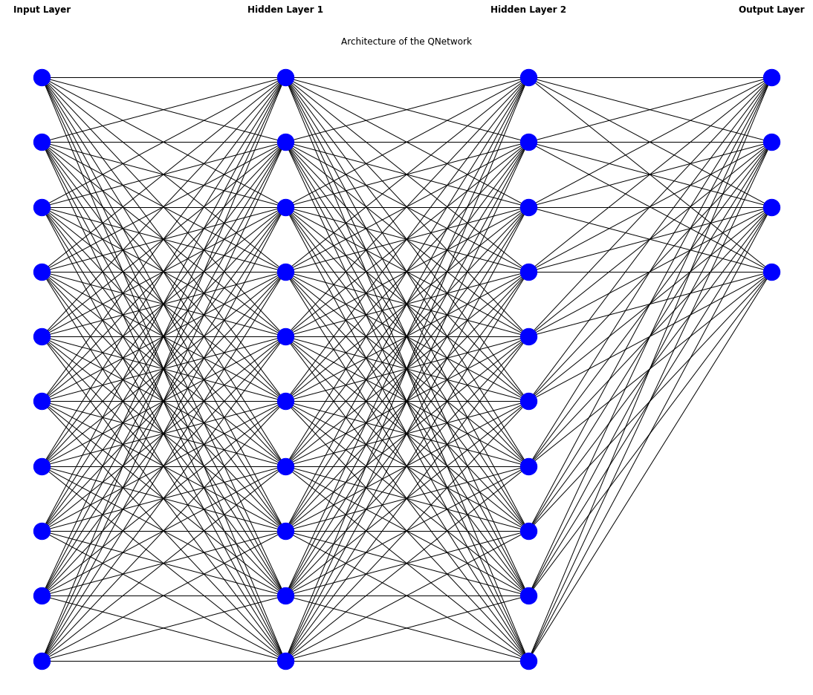
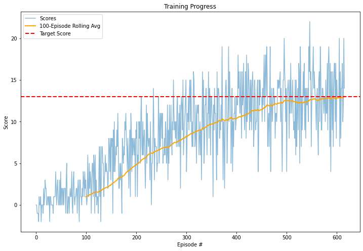
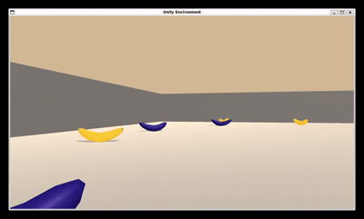
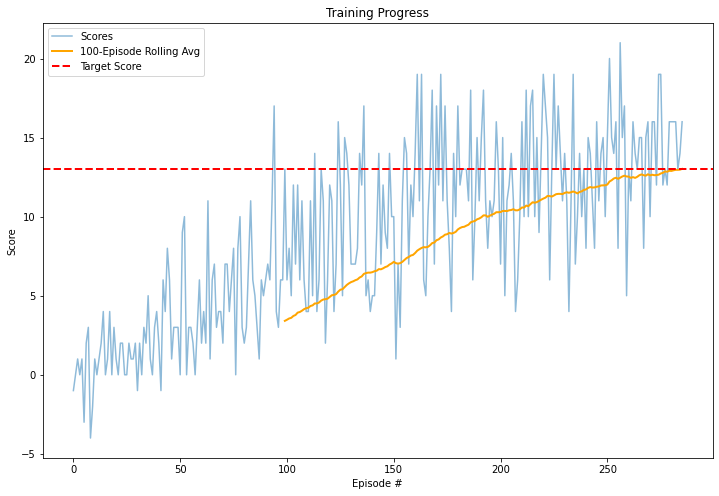
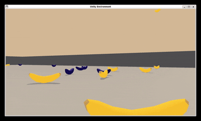
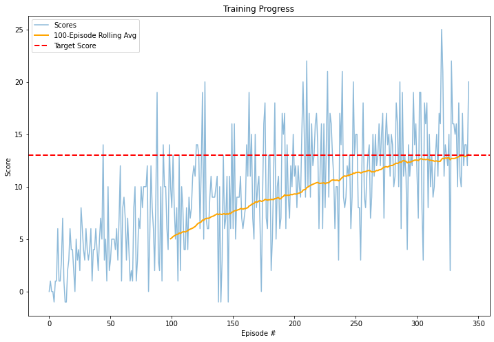
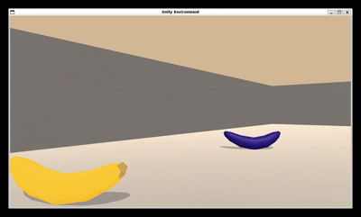
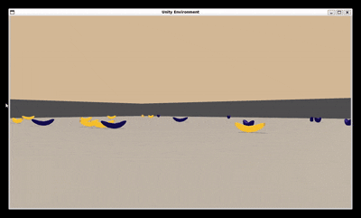

# Report Introduction

This report contains of three main sections. In the first section [Learning Algorithm](#learning-algorithm) the technicalities are explained. In this section the Model Architecture, DQN Agent and the Deep Q Learning Algorithm used for this project are introduced and explained. The second section [Plot of Rewards](#plot-of-rewards) contains visualizations of the scores achieved during training. Various hyperparameters were tested and documented here. In the third section [Ideas for Future Work](#ideas-for-future-work) multiple approaches to include in future work on this project are proposed.

- [Report Introduction](#report-introduction)
- [Learning Algorithm](#learning-algorithm)
  - [Model Architecture](#model-architecture)
  - [DQN-Agent](#dqn-agent)
  - [Deep Q Learning Algorithm](#deep-q-learning-algorithm)
- [Plot of Rewards](#plot-of-rewards)
- [Ideas for Future Work](#ideas-for-future-work)
  - [References](#references)

# Learning Algorithm

## Model Architecture

The QNetwork, which we already implemented earlier in this course, was utilized as model for solving the banana collector problem. This QNetwork consists of an input layer representing the number of states (37), two hidden layers, both with 64 nodes, followed by an output layer, consisting of the amount of available actions (4). The output layer produces the final q-value for all possible actions. Both hidden Layers are followed by a ReLu activation function. The following figure represents a less complex depiction of the implemented model architecture of the QNetwork (e.g. the input layer should have 37 nodes and the two hidden layers should each have 64 nodes).



In the script `model.py` one can find the implementation of the QNetwork. The following code snippet shows the QNetwork once more. The implementation of the QNetwork was taken from the previous exercises in the course.

```bash
class QNetwork(nn.Module):
    """Actor (Policy) Model."""

    def __init__(self, state_size, action_size, seed, fc1_units=64, fc2_units=64):
        """Initialize parameters and build model.
        Params
        ======
            state_size (int): Dimension of each state
            action_size (int): Dimension of each action
            seed (int): Random seed
            fc1_units (int): Number of nodes in first hidden layer
            fc2_units (int): Number of nodes in second hidden layer
        """
        super(QNetwork, self).__init__()
        self.seed = torch.manual_seed(seed)
        self.fc1 = nn.Linear(state_size, fc1_units)
        self.fc2 = nn.Linear(fc1_units, fc2_units)
        self.fc3 = nn.Linear(fc2_units, action_size)

    def forward(self, state):
        """Build a network that maps state -> action values."""
        x = F.relu(self.fc1(state))
        x = F.relu(self.fc2(x))
        return self.fc3(x)
```

## DQN-Agent

The DQN Agent can be found in the `dqn_agent.py`. The agent offers a variety of hyperparameters. The selection of the parameters for this project was motivated by the introduced parameters in the course. The first hyperparameter represents the Replay Buffer Size. It stores past experiences (meaning the state, action, reward, next state, and done tuple) of the agent agent to be sampled from. A larger Buffer allows the agent to learn from more experiences. However, the memory also increases by increasing replay buffer size. For the trained agents in this project a reaply buffer size of 100,000 was selected. Next, for the agent a batch size of 64 was defined. The batch size defines the number of experiences sample form the replay buffer for each training step. The larger the size, the more stability and computational resources for the learning. The discount factor (GAMMA) for the agent was set to 0.99. This factor describes how much future rewards contribute to current Q-Values. A higher gamma leads the agent to set a bigger emphasis on long-term rewards. In contrast lower gammas results in a greater focus of the agent on immediate rewards. The agents soft update parameter (TAU), which is responsible for how much the target network is updated with local weights of the network, was set to a value of 0.001. Lower tau results in slower, but a more stable learning. The agents learning rate was set to 0.0005. Finally, the update frequency (UPDATE_EVERY) was set to 4. The update frequency determines how often network updates occur. The DQN-Agent was used from previous exercises in the course.

## Deep Q Learning Algorithm

In the script `dqn_training.py` one can find the implementation of the deep Q learning algorithm in the function dqn. This function is mostly adpated from previous exercises in the course with minor adjustments. Before running the dqn function, one needs to retrieve the brain name from the Banana agent, initialize the environment and the agent and reset the environment. The Agents state size is set to 37 (as the state states dimension is 37), the action size is set to 4 (as for actions are possible) and the seed is set to 0. The brain name, the environment and the agent are passed as arguemnts to the dqn function. Further Hyperparameters have to be defined. Such as the number of episodes, the maximum number of timesteps per episode the starting value of the epsilon for the epsilon-greedy action selection, the minimum vale of espilon and the epsilon decaying rate. In the first trial the maximum number of timesteps per episode was set to 1000, an epsilon start for the epsilon-greedy action selection was set to 1.0, a minimum value for epsilon of was set to 0.01, and an epsilion decay was set to 0.995. Further tests of different Hyperparameters can be found in the section [Plot of Rewards](#plot-of-rewards). 

Short Overview of the meaning of hyperparameters of the dqn function
- n_episodes / number of episodes: Maximum Episodes for the Training, more episodes mean mor etraining and more computation time
- max_t / Max Timesteps per Episode: Sets Max number of actions the agent can take within an episode. 
- eps_start /Starting Epsilon: controls the exploration - higher values mean more random actions at the beginning with more exploration. 
- eps_end / Minimum value of Epsilon: Ensures a minimum level of exploration until the end of the training.
- eps_decay / Epsilon Decay Rate: decides how fast agent switches from exploration to exploitation

The algorithm works as follows. First an empty list of scores, a deque of the scores window cotaining the last 100 scores and the initial epsilon (with eps_start parameter) are initialized. Next, we iterate through the episodes (until the maximum number of episodes is reached or a break statement is reached). In each iteration, the environment is reset, the current state is retrieved and the score/reward is set to 0. Within this episode iteration, we then iterate again but for the maximum number of timesteps based on the max_t parameter or until the done statetment is True. Within this iteration the agent first selcets an action based on the current state. The epsilon is used here for the greed-exploration (e.g.: sometimes the agent selects random actions for the sake of exploration). Then the agent executes the action in the environment and the environment is set one step forward. Afterwards the environment gives the new state after the action. The agent than receives the reward for taking this action. Further, we retrieve wheter the episodes is done or not from the environment information. This information we store in the done variable. Then the agent stores the experience in the Replay Bffer. In case its time to update, the agent samples a batch of experieneces and trains the QNetwork. Then the agent updates the state to the new state for the next iteration within the current episode. The score of the episode is then updated. When now the variable done is True, and thus current episode has reached the end, the current iteration will break and further information is collected and adjusted. After completing the episode, the most recent score is saved in the score list and the scores_window deque. Next, the epsilon is update with the maximum of the epsilon decay times the current epsilon or the minimum value for espilon. Then the average score over the last 100 episodes is printed in the same terminal line and every 100 episodes the average score is kept in the console output and a new line is created. As soon as an average score of 13.0 is reached, the algorithm breaks and the training is done. The model weights get stored in the respective directory with the respective trial number which was passed in the arguments `results/model_weights/checkpoint_{training_trial_number}.pth`

The dqn function from the script `dqn_training.py` can be also found in the following code snippet:

```bash
def dqn(brain_name, env: UnityEnvironment, agent: Agent, n_episodes: int = 2000, max_t: int = 1000, eps_start: float = 1.0, eps_end:float = 0.01, eps_decay: float = 0.995, training_trial_number: str = '03') -> list:
    """Deep Q-Learning.
    
    Params
    ======
        brain_name (str): name of the brain in the unity env.
        env (UnityEnvironment): The Unity env instance in which the agent interacts. Provides states, rewards, etc.
        agent (Agent): rl agent that interacts with env
        n_episodes (int): maximum number of training episodes
        max_t (int): maximum number of timesteps per episode
        eps_start (float): starting value of epsilon, for epsilon-greedy action selection
        eps_end (float): minimum value of epsilon
        eps_decay (float): multiplicative factor (per episode) for decreasing epsilon
    """
    scores = []                        # list containing scores from each episode
    scores_window = deque(maxlen=100)  # last 100 scores
    eps = eps_start                    # initialize epsilon
    for i_episode in range(1, n_episodes+1):
        # Reset env, extract the data  and extract the state.
        env_info = env.reset(train_mode=True)[brain_name] 
        state = env_info.vector_observations[0]  
        score = 0
        for t in range(max_t):
            action = agent.act(state, eps)
            # Retrive step result, extract next state and the reward
            env_info = env.step(action)[brain_name]
            next_state = env_info.vector_observations[0]
            reward = env_info.rewards[0] 
            done = env_info.local_done[0] 
            agent.step(state, action, reward, next_state, done)
            state = next_state
            score += reward
            if done:
                break 
        scores_window.append(score)       # save most recent score
        scores.append(score)              # save most recent score
        eps = max(eps_end, eps_decay*eps) # decrease epsilon
        print('\rEpisode {}\tAverage Score: {:.2f}'.format(i_episode, np.mean(scores_window)), end="")
        if i_episode % 100 == 0:
            print('\rEpisode {}\tAverage Score: {:.2f}'.format(i_episode, np.mean(scores_window)))
        if np.mean(scores_window)>=13.0:
            print('\nEnvironment solved in {:d} episodes!\tAverage Score: {:.2f}'.format(i_episode-100, np.mean(scores_window)))
            torch.save(agent.qnetwork_local.state_dict(), f'results/model_weights/checkpoint_{training_trial_number}.pth')
            break
    return scores
```

# Plot of Rewards

Various training trials with a DQN-Agent have been made. In this section plots of the training process can be visually inspected. In addition, gifs of the respective agent with the model weights were created to see visually what the trained agent does.

In all trials, the agent achieved relative quickly the 100-episode average score of 13.0. In the first trial, a maximum number of timesteps per episode of 1000, an epsilon start for the epsilon-greedy action selection of 1.0, a minimum value for epsilon of 0.01, and an epsilion decay of 0.995 was selected. The agend achieved the target score after more than 600 episodes. The respective weigths can be found in the following file: The file `src/results/model_weights/chechpoint_01.pth` containtes the weights of this trial. The target score was reached, however when checking the trained agent in the Unity Environment with the saved model weights one can clearly see, the agent is not behaving as expected. It seems like the agent only learned to go from left to right. This seem quite odd, as the training score was reached. One reason could be that during experiement the wrong weights were saved. However, to avoid this behaved learning pattern, a new trial is conducted with adjusted hyperparameters.




The second trial represents another Training Trial, but with different Parameters for the DQN. After the 286 Episode the agent reached the respecive goal of an average score of 13.0 over 100 episodes. Thus, this agent achieved the target score the fastest so far. Further the epsilon decay was reduced for this trail to 0.9, and the minimum value for epsilon was increased to 0.02. Finally, the maximum number of timesteps per episode was increased to 1200. In the plot below one can see the Scores during the training progress. The weights for this trail can be found here: `src/results/model_weights/chechpoint_02.pth`. In contrast, to the first agent this agent already performs as the agent is expected to perform. It collects yellow bananas and avoids blue ones. 




In the third trial, the agent needed 343 episodes to reach the target average score of 13.0 over at least 100 consecutive episodes. The maximum number of timesteps per episodes were increased to 1500, the minimum value for epsilon was increased to 0.03, and the epsilon decay was reduced to 0.89. The model weights can be found here: `src/results/model_weights/chechpoint_03.pth`. In contrast, to the first agent this agent already performs as the agent is expected to perform. It collects yellow bananas and avoids blue ones. 




In the fourth and last trial, the agent needed a total of 301 episodes to reach an average score of 13.0 over 100 consecutive episodes. Similar to the second trial, the maximum number of timesteps per episodes was set to 1200 and the minimum value for epsilon was set to 0.02. However, for this trial the epsilon decay was reduced to 0.8. The amount of The model weights can be found here: `src/results/model_weights/chechpoint_04.pth`. In contrast, to the first agent this agent already performs as the agent is expected to perform. It collects yellow bananas and avoids blue ones.





# Ideas for Future Work

In general, one can experiement with adding more hidden layers, adjusting the number of nodes in the hidden layers or adjusting the parameters of the DQN-Agent to improve the agent. Van Hasselt et al. (2015) demonstrate that adressing overestimations of action values from the Q-Learning algorithm, which occur in some Atari 2600 games, improves results. Given this, exploring methods to adress overestimation could be a valuable avenue for enhancing the implemented banana collector. Another promising idea could be to learn from images to navigate through the world. Therefore, one needs to design a convolutional neural network as the DQN architecture. The research of Mnih et al. (2015) provide a great inspiration for implementing such an architecture. Furthermore, Prioritized Experience Replay (PER) improves DQN by prioritizing significant experiences for replay, rather than sampling uniformly from the replay buffer (Schaul et al., 2015). This ensures that important transitions are learned more frequently, improving sample efficiency and accelerating learning (Schaul et al., 2015). Schaul et al. (2015) demonstrates that DQN with PER outperforms standard DQN in 41 out of 49 Atari games, making it a promising method to enhance DQN Learning. Thus, utilizing PER could further help to improve our current implementation. Another potential improvement for the current implementation is to integrate the dueling network architecture (e.g. Wang et al., 2015), which separates the state value function and the action advantage function. This approach enhances policy evaluation, especially when many actions have similar values, leading to more efficient learning (Wang et al., 2015). Wang et al. (2015) showed that this architecture outperforms traditional DQN in environments like Atari 2600.

Below follows a short summary of the possible future improvements for this project:
- Add more hidden layers, adjust number of nodes of hidden layers, and ajdust parameters of DQN-Agent or the Deep-Q-Learning function.
- Double Q-Learning (Van Hasselt et al. (2015))
- Learning from Pixels via Convolutional Neural Networks as the DQN architecture (Mnih et al. (2015))
- Prioritized Experience Replay (Schaul et al., 2015)
- Dueling Network Architectures for Deep Reeinforcement Learning (Wang et al., 2015)

## References
1. van Hasselt, H., Guez, A., & Silver, D. (2015). Deep Reinforcement Learning with Double Q-learning (Version 3). arXiv. https://doi.org/10.48550/ARXIV.1509.06461
2. Mnih, V., Kavukcuoglu, K., Silver, D., Rusu, A. A., Veness, J., Bellemare, M. G., Graves, A., Riedmiller, M., Fidjeland, A. K., Ostrovski, G., Petersen, S., Beattie, C., Sadik, A., Antonoglou, I., King, H., Kumaran, D., Wierstra, D., Legg, S., & Hassabis, D. (2015). Human-level control through deep reinforcement learning. In Nature (Vol. 518, Issue 7540, pp. 529–533). Springer Science and Business Media LLC. https://doi.org/10.1038/nature14236 
3. Schaul, T., Quan, J., Antonoglou, I., & Silver, D. (2015). Prioritized Experience Replay (Version 4). arXiv. https://doi.org/10.48550/ARXIV.1511.05952
4. Wang, Z., Schaul, T., Hessel, M., van Hasselt, H., Lanctot, M., & de Freitas, N. (2015). Dueling Network Architectures for Deep Reinforcement Learning (Version 3). arXiv. https://doi.org/10.48550/ARXIV.1511.06581